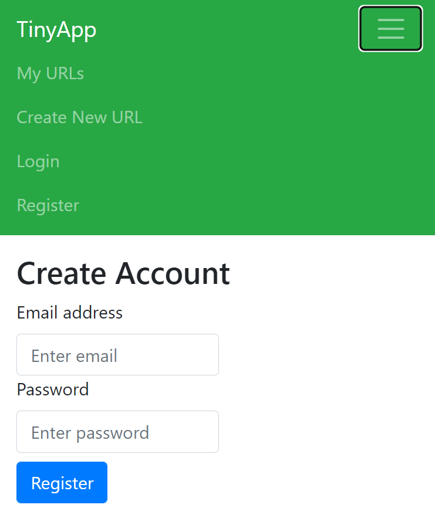
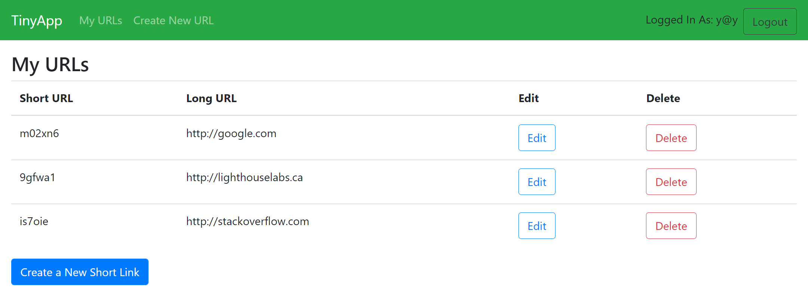
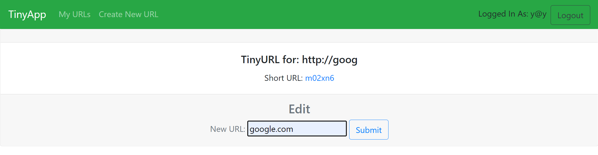

# TinyApp

TinyApp is a full stack web application built with [Node.js](https://nodejs.org) and [Express](https://expressjs.com) that allows users to manage and share shortened long URLs with their friends.

## Purpose

**_BEWARE:_ This app was created for learning purposes. It is _not_ intended for use in production-grade software.**

This project was created and published by me as part of my learnings at Lighthouse Labs.

## TinyApp in Action




## Using TinyApp

### Setup
To setup TinyApp, ensure you have Node.js installed, then execute the following.
```
git clone git@github.com:l-m-meyer/tinyapp.git
cd tinyapp
npm install
```

## Development

### Directory Structure
```
./                Main project directory
./views           EJS page templates
./views/partials  Partial EJS template used by views
./helpers         Helper functions
./test            Unit tests
```

### Dependencies
* [bcryptjs](https://www.npmjs.com/package/bcryptjs)
* [body-parser](https://www.npmjs.com/package/body-parser)
* [cookie-session](https://www.npmjs.com/package/cookie-session)
* [ejs](https://www.npmjs.com/package/ejs)
* [express](https://www.npmjs.com/package/express)

### Development Dependencies
The following NPM packages are used:
* [nodemon](https://www.npmjs.com/package/nodemon)
* [mocha](https://www.npmjs.com/package/mocha)
* [chai](https://www.npmjs.com/package/chai)


### Run
It is preferred to use nodemon to automatically restart the server when files change while working on TinyApp.
```
npm start
```

### Testing
Unit tests can be run using:
```
npm test
```
Test scripts can be found in `test` directory.